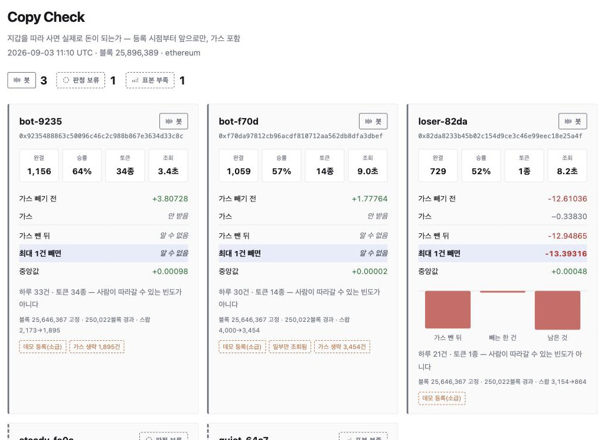
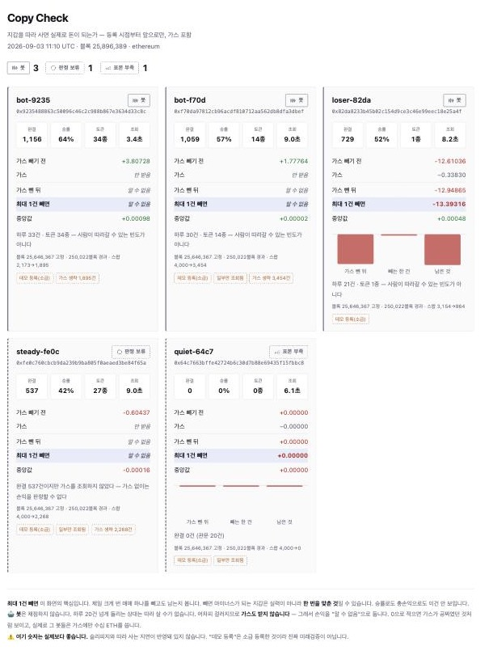

# Copy Check

**Is that wallet actually worth copying — after gas, and counted only forward from the day you found it?**

<p align="center">
  
</p>

---

## The problem

Copy-trading dashboards rank wallets by win rate and total PnL. Both lie.

- **Win rate lies.** A wallet we tracked closed 68 trades at a 38% win rate and still showed `+0.033 ETH` after gas. Remove its single largest winning trade and it became `-0.083 ETH`. To copy that wallet profitably you had to be inside *one specific trade*. That is a timing problem, not a wallet-selection problem.
- **Gas lies by omission.** One wallet in our sample sat at `-0.00001 ETH` before gas — essentially break-even — and `-0.00197 ETH` after. **99% of the loss was gas.** Measured gas per swap ranged from `0.000030` to `0.003157 ETH`, a **104× spread**, so estimating it from block base fee is not good enough.
- **Backtests lie.** Any score computed over a wallet's past is a number you chose after seeing the answer.

## What this tool does instead

Three rules, each of which the code enforces rather than merely documents.

### 1. Forward-only. The clock starts when you register the wallet.

`scan.py add 0x…` pins the current block into `wallets.json` and **never changes it**. Trades before that block are discarded and counted separately as `skipped_pre_pin` — `verdict.score()` filters them out even if the caller passes them in.

### 2. Gas is measured, never estimated.

The Uniswap v3 subgraph exposes `transaction.gasUsed` but ships it as `0`. So tx hashes come from the subgraph and gas comes from RPC receipts, 12 workers in parallel. Receipts that fail to fetch stay `None` and are counted — they are **not** filled with `0`, because "gas was zero" and "we didn't get the gas" are different facts.

### 3. Drop the single best trade and see what's left.

```
net           = realized − gas
net_ex_best   = (realized − best_single_win) − gas
```

If a wallet only survives with its best trade included, it is reported as *one-hit dependent*, not as a pass.

## Verdicts

| Verdict | Meaning |
|---|---|
| `🟢 통과` (pass) | Profitable after gas, **and** still profitable with the best single trade removed |
| `🎲 한 방 의존` (one-hit dependent) | Profitable overall, but negative once the best trade is removed |
| `🔴 탈락` (fail) | Nothing left after gas |
| `🤖 봇` (bot) | Trades at a frequency a human cannot follow — not scored at all |
| `⏳ 표본 부족` (too few) | Fewer than 20 closed round-trips |
| `⚪ 판정 보류` (withheld) | Gas was not retrieved, so no profit judgment is made |

The last three are the point of the design. **A judgment without evidence is worse than a wrong one, because you can't tell it's wrong.** The UI shows page-limit truncation, skipped gas lookups, and demo registration on every card rather than hiding them.

Two of these thresholds are themselves defended against measurement artifacts:

- **Bot detection uses trades *per day*, not total trades.** With a total-count threshold, raising `max_pages` from 2 to 4 flipped the same wallet from pass to bot. The verdict was tracking *how much we looked*, not how the wallet performed. If the observation window is unknown, bot detection is skipped entirely.
- **No gas, no verdict.** Wallets over 1,000 swaps skip gas lookup for speed. One of them did not trip the bot rule and received a `🔴 fail` computed with zero gas. That path now returns `⚪ withheld` instead.

## Quickstart

```bash
cp .env.example .env         # add a free The Graph API key
python3 verdict.py           # self-test: no network, no key needed

python3 scan.py add 0xWALLET nickname   # pin the wallet at the current block
python3 scan.py list                    # registered wallets and elapsed blocks
python3 scan.py                         # score everything → out/verdicts.json
python3 build_page.py                   # → out/index.html
```

`out/index.html` reads only the JSON. No network, no API key, opens offline, deploys as a static file.

## Layout

| File | Role |
|---|---|
| `verdict.py` | Scoring rules. FIFO round-trip matching, gas subtraction, drop-the-best test. **Knows nothing about data sources** — takes a list of swaps, so it runs and self-tests with no API key. |
| `fetch.py` | Subgraph swaps → `Swap` objects. Decides buy vs sell from `amount0`/`amount1` signs, counts what it skipped. |
| `gas.py` | Real gas from RPC receipts, 12 parallel workers, on-disk cache. |
| `graph.py` | The Graph gateway client. |
| `scan.py` | Registry (`add` / `list` / scan) → `out/verdicts.json`. |
| `build_page.py`, `icons.py` | JSON → static HTML, inline SVG icons. |
| [`NOTES.md`](NOTES.md) | Twelve things measurement contradicted the docs about. Written during the build. |

Performance: **270–450s per wallet → 4.5–7.4s**, up to 80×. The bottleneck was never the subgraph (8.2s for 3,447 swaps) — it was sequential gas lookups (8.7 minutes for the same set).

## Limitations

Stated plainly, because the tool's whole argument is about not hiding things.

- **Slippage and copy latency are not modeled.** Real copy-trading is worse than these numbers.
- **Uniswap v3 on Ethereum only.** One subgraph, one DEX.
- **WETH is the only quote asset.** Mixing WETH with stablecoins produced a `+299,923 ETH` result from unit mixing; the same wallet came out at `-98 ETH` once the quote was fixed to WETH alone. Non-WETH pairs are skipped and counted.
- **The wallets shipped in `wallets.json` are demo registrations** (`--back`, retro-pinned) so the UI has something to show. They are marked `demo: true` and are **not** real forward verification.
- **The UI is in Korean.** The code, comments and `NOTES.md` are too.
- **No `🟢 pass` in the sample set.** Five wallets: three bots, one withheld, one too few trades. That is the honest current output, not a curated demo.

## Screen

<p align="center">
  
</p>

Built for ETHOnline. Data: The Graph (Uniswap v3 Ethereum subgraph) + public Ethereum RPC.

---
---

# 한국어

**저 지갑, 따라 사면 실제로 돈이 되는가 — 가스까지 빼고, 내가 발견한 날부터 앞으로만 세서.**

## 무엇이 문제인가

카피트레이딩 순위표는 승률과 총손익으로 지갑을 줄 세운다. 둘 다 거짓말을 한다.

- **승률이 거짓말한다.** 추적하던 지갑 하나가 완결 68건 · 승률 38%인데 가스 후 `+0.033 ETH`로 통과처럼 보였다. 가장 크게 번 한 건을 빼니 `-0.083 ETH`. 따라 해서 돈을 벌려면 **그 한 건에 타 있어야** 했다. 그건 지갑을 고르는 문제가 아니라 타이밍 문제다.
- **가스는 빼먹어서 거짓말한다.** 표본의 어떤 지갑은 가스 전 `-0.00001 ETH`(사실상 본전)인데 가스 후 `-0.00197 ETH`였다. **손실의 99%가 가스였다.** 실측 가스는 건당 `0.000030`~`0.003157 ETH`로 **104배** 차이가 나서, 블록 baseFee로 뭉개서 추정하면 판정이 통째로 틀어진다.
- **백테스트가 거짓말한다.** 과거를 놓고 계산한 성적은 답을 본 뒤에 고른 숫자다.

## 대신 이 도구가 하는 일

규칙 셋. 전부 문서가 아니라 **코드가 강제**한다.

### 1. 미래로만 센다. 시계는 등록하는 순간 시작된다.

`scan.py add 0x…` 가 현재 블록을 `wallets.json`에 못박고 **절대 바꾸지 않는다.** 그 블록 이전 거래는 버리고 `skipped_pre_pin`으로 따로 센다. 호출자가 실수로 과거를 넣어도 `verdict.score()`가 걸러낸다.

### 2. 가스는 추정하지 않고 실측한다.

유니스왑 v3 서브그래프에 `transaction.gasUsed` 필드는 있는데 값이 `0`으로 채워져 온다. 그래서 tx 해시만 서브그래프에서 뽑고, 가스는 RPC 리시트로 12워커 병렬 조회한다. 못 받은 건은 `None`으로 두고 개수를 센다 — **`0`으로 채우지 않는다.** "가스가 없었다"와 "우리가 못 받았다"는 다른 사실이기 때문이다.

### 3. 제일 크게 번 한 건을 빼고 다시 본다.

```
가스 뺀 뒤      = 실현손익 − 가스
최대 1건 빼면   = (실현손익 − 최대이익 1건) − 가스
```

그 한 건이 있어야만 남는 지갑은 **통과가 아니라 「한 방 의존」**으로 따로 표시한다.

## 판정

| 판정 | 뜻 |
|---|---|
| `🟢 통과` | 가스 빼고도 남고, 최대 1건을 빼도 남는다 |
| `🎲 한 방 의존` | 남긴 남는데, 최대 이익 1건을 빼면 마이너스 |
| `🔴 탈락` | 가스 빼면 남는 게 없다 |
| `🤖 봇` | 사람이 따라갈 수 없는 빈도 — 채점 자체를 안 한다 |
| `⏳ 표본 부족` | 완결 왕복이 20건 미만 |
| `⚪ 판정 보류` | 가스를 못 받았으므로 손익 판정을 하지 않는다 |

뒤의 셋이 이 설계의 핵심이다. **근거 없는 판정은 틀린 판정보다 나쁘다 — 틀린 줄도 모르기 때문이다.** 화면은 페이지 상한에 걸렸는지, 가스를 생략했는지, 데모 등록인지를 카드마다 그대로 표시한다. 좋아 보이게 만드는 게 목적이 아니다.

이 중 두 개는 **관측량이 판정을 흔드는 것**을 막으려고 다시 고친 기준이다.

- **봇 판별은 총 건수가 아니라 하루 빈도로 한다.** 총 500건을 기준으로 잡았더니 `max_pages`를 2에서 4로 올리는 것만으로 같은 지갑이 통과 → 봇으로 뒤집혔다. 판정이 "얼마나 벌었나"가 아니라 **"우리가 얼마나 봤나"**를 따라간 것이다. 관측 구간을 모르면 봇 판정을 아예 건너뛴다.
- **가스를 모르면 판정하지 않는다.** 스왑 1,000건이 넘으면 속도 때문에 가스를 생략하는데, 그중 봇 판정이 안 나온 지갑이 **가스 없이 `🔴 탈락`**을 받은 적이 있다. 화면엔 `가스 −0.00000`으로 찍혀서 가스가 공짜였던 것처럼 보였다. 지금은 `⚪ 판정 보류`가 나간다.

## 시작하기

```bash
cp .env.example .env         # The Graph API 키 채우기 (무료)
python3 verdict.py           # 자체 검증 — 네트워크도 키도 필요 없음

python3 scan.py add 0x지갑 별명   # 지금 블록에 못박고 등록
python3 scan.py list             # 등록 현황과 경과 블록
python3 scan.py                  # 전부 채점 → out/verdicts.json
python3 build_page.py            # → out/index.html
```

`out/index.html`은 JSON만 읽는다. 네트워크도 API 키도 없어서 오프라인에서 열리고 정적 호스팅에 그대로 올라간다.

## 구조

| 파일 | 역할 |
|---|---|
| `verdict.py` | 판정 규칙. FIFO 왕복 매칭, 가스 차감, 최대 1건 제외 테스트. **데이터 소스를 모른다** — 스왑 목록만 받으므로 API 키 없이 돌고 자체 검증이 된다. |
| `fetch.py` | 서브그래프 스왑 → `Swap` 변환. `amount0`/`amount1` 부호로 매수·매도를 판단하고, 건너뛴 것을 센다. |
| `gas.py` | RPC 리시트로 실제 가스 조회. 12워커 병렬 + 디스크 캐시. |
| `graph.py` | The Graph 게이트웨이 클라이언트. |
| `scan.py` | 지갑 등록부(`add`/`list`/채점) → `out/verdicts.json`. |
| `build_page.py`, `icons.py` | JSON → 정적 HTML, 인라인 SVG 아이콘. |
| [`NOTES.md`](NOTES.md) | 문서와 다르게 동작한 12가지. 만들면서 그때그때 적은 것. |

속도: **지갑당 270~450초 → 4.5~7.4초**, 최대 80배. 병목은 서브그래프가 아니라(스왑 3,447건에 8.2초) 순차 가스 조회였다(같은 양에 8.7분).

## 한계

숨기지 않는 것이 이 도구의 주장이므로, 한계도 그대로 적는다.

- **슬리피지와 따라 사는 지연은 반영돼 있지 않다.** 실제 카피는 이 숫자보다 나쁘다.
- **이더리움 유니스왑 v3만 본다.** 서브그래프 하나, DEX 하나.
- **기축은 WETH 하나뿐.** WETH에 스테이블을 섞었더니 단위가 섞여 `+299,923 ETH`(1조원대)라는 허수가 나왔고, 기축을 WETH로 고정하니 같은 지갑이 `-98 ETH`로 뒤집혔다. WETH가 아닌 페어는 건너뛰고 개수를 센다.
- **`wallets.json`에 들어있는 지갑은 데모 등록이다**(`--back`, 소급 못박기). 화면에 보여줄 게 필요해서 넣은 것이고 `demo: true`로 표시된다. **진짜 미래검증이 아니다.**
- **화면이 한국어다.** 코드 주석과 `NOTES.md`도 마찬가지.
- **표본에 `🟢 통과`가 하나도 없다.** 지갑 5개 중 봇 3, 판정 보류 1, 표본 부족 1. 꾸며낸 데모가 아니라 지금 나오는 실제 결과다.

ETHOnline 출품작. 데이터: The Graph(유니스왑 v3 이더리움 서브그래프) + 공개 이더리움 RPC.
